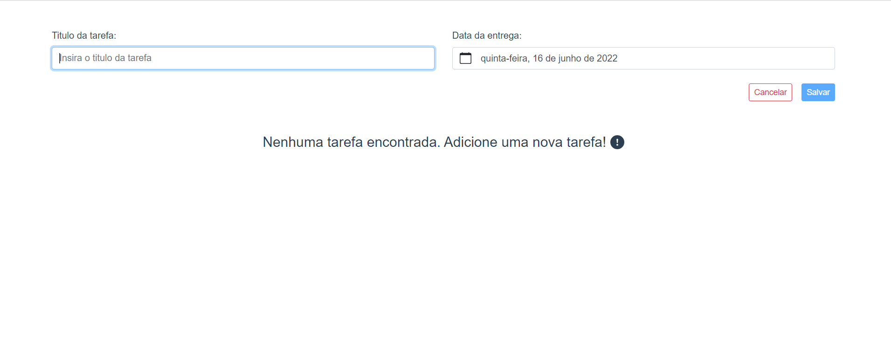
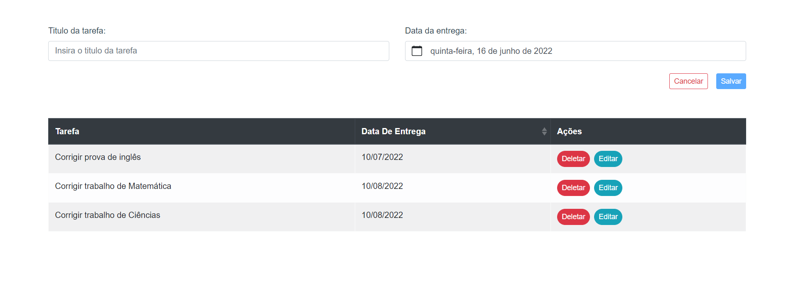

# Gerenciador de Tarefas

---

## Projeto desenvolvido com as seguintes tecnologias:

- BootstrapVue

[Documentação BootstrapVue](https://bootstrap-vue.org/)

- Axios

[Documentação Axios](https://axios-http.com/docs/intro)

## Dependências utilizadas

- Axios
- Bootstrap-vue
- core-js
- Vue

## Clonando projeto

[`https://github.com/erikasantanaa/Gerenciador-de-Tarefas.git`](https://github.com/erikasantanaa/Gerenciador-de-Tarefas.git)

## Instalando as depencências

`npm install`

## Como rodar o projeto

`npm run serve`

## Observação:

O projeto ainda não foi concluído!